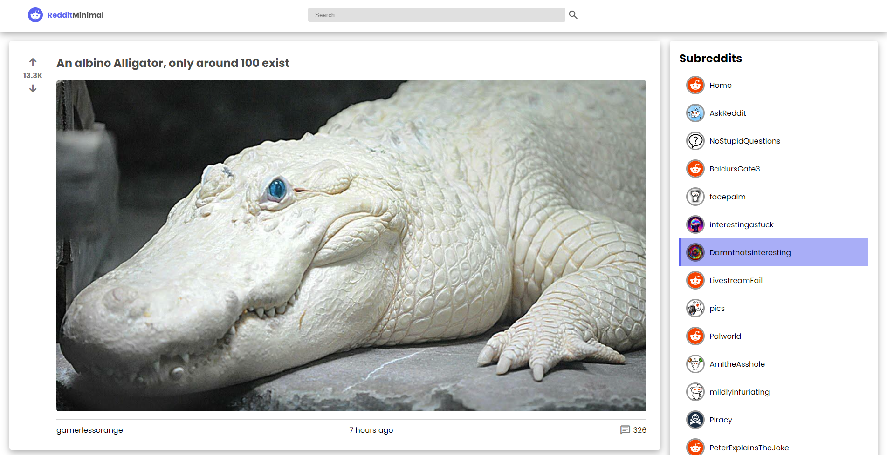

# Reditt Mini Clone

## Beskrivelse
Dette prosjektet er en enkel klone av Reddit. Den er bygget for å demonstrere bruk av React-komponenter og React Hooks. 

Siden laster inn de 25 mest populære subreddit-kategoriene. Siden henter de siste postene fra aktiv subreddit. Jeg har også laget en søkefunksjon som lar deg søke blant postene på aktiv subreddit. 
Det er også mulig å se kommentarer fra brukere med tidsstempler, brukernavn, og du kan up/downvote innlegg.

## Teknologier
- **React**
- **Redux Store**
- **JavaScript (ES6+)**
- **Axios**
- **React Router**
- **javascript-time-ago**
- **Webpack**
- **CSS Media Queries og CSS Variabler**

## Installasjon
1. Klon repoen: `git clone https://github.com/brukernavn/prosjektnavn.git`
2. Installer avhengigheter med: `npm install` eller 'npm i'
3. Naviger deg inn i client mappen
4. Start prosjektet med: `npm start`

## Bruk
Dersom ikke VS-code (eller editoren du bruker) automatisk åpner browseren så gå til `localhost:3000`.

## Screenshot av forsiden

## Bidrag
Åpen for bidrag. Vennligst lag en pull request hvis du har forbedringer :)
